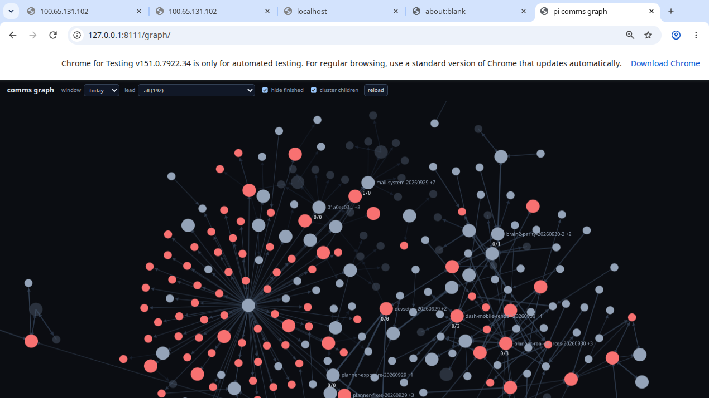
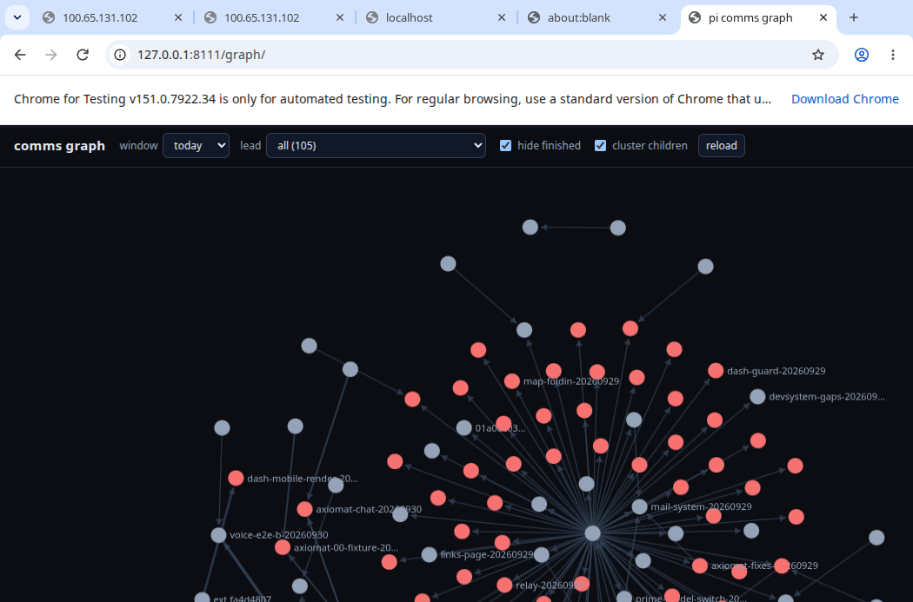
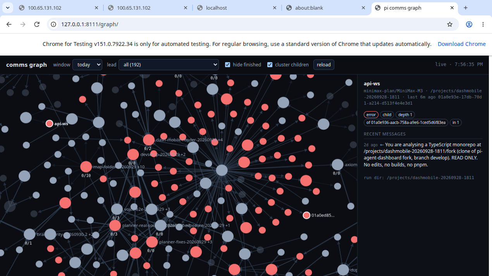
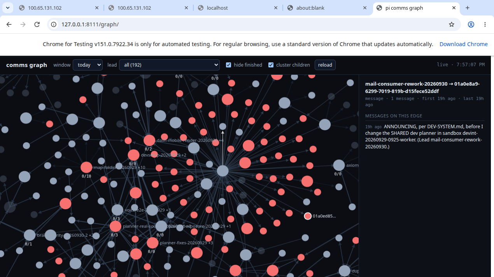
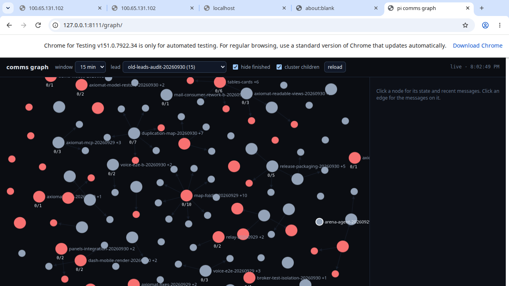
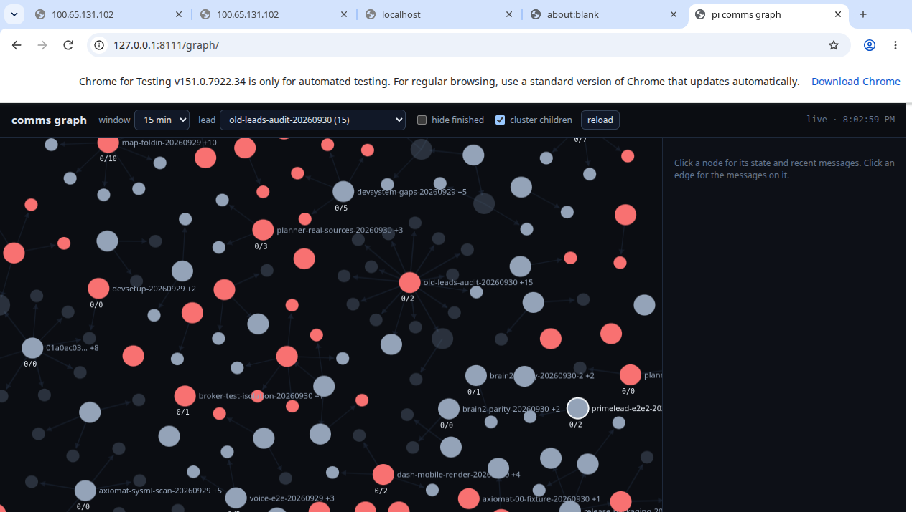

# The comms graph: what it reads, what it costs, and how it was measured

Companion to the `/graph/` section of the README. The images are captures of
the page running in a sandbox against a copy of a real corpus. Every number here was measured
on this machine; the command that produced it is given so a reader can disagree
with the number rather than with the vibe.

## What it looks like

| | |
|---|---|
|  | **Converged**: 528 nodes, 953 edges over a 877-file corpus. Each cluster badge is `folded children / gone children`. |
|  | **Cold start**, mid-ingest: the page says `filling in… (N nodes so far)` rather than pretending to be complete. |
|  | **Click a node**: model, run dir, age, state badges, parent, recent message first lines. |
|  | **Click an edge**: the messages on it, first lines only. |
|  | **Filters**: last 15 minutes, one lead's subtree, hide finished — `144 nodes · 71 edges · 55 clusters`. |
|  | The same view with *hide finished* unticked: `223 nodes · 157 edges`. The pair is the regression evidence for the filter. |

Node colours: green working, blue idle, amber stalled (silent for 45 minutes
while the daemon still calls it working), red error, grey gone, dim unknown.
A red cluster in these captures is real: 169 `agent_status` records in this
corpus carry `taskState: "error"` with the summary
`Model request failed: Provider rate limit exceeded ... Token Plan usage limit
reached` — the day's 429 storm, drawn as what it was.

## Where the facts come from

| fact | source | note |
|---|---|---|
| parent / child | `~/.prime/agent/rlm-ledger/<hex>.jsonl`, `spawn` / `delete` ops | There is **no** parent pointer inside a session transcript. Do not go looking for one. |
| child transcripts | `session-artifacts/<parentId>/sub-<x>/<childId>.jsonl`, depth 2+ | No `session_info` record; the name is in the ledger and in `rlm-subagent.json` beside the transcript. |
| messages | `custom_message` with `customType: "agent_message"` -> `details.from` / `details.target` | The rules are reused from `/projects/agent-collab-20260930/artifacts/index2.py`, not rewritten. |
| node state | `agent_status.status.taskState` | |
| context %, model, liveness | `<sid>.meta.json` | The only place the daemon writes `contextTokens` / `contextWindow` / `live`. |
| goal status | `custom` with `customType: "thread_goal_state"` | |
| relay | `custom` with `customType: "atelier-prime-relay"`, `fired: true` | The only durable trace a relay leaves besides its successor's name. |

**The relay edge is a corroborated guess, and the code says so.** Nothing links a
predecessor to its `-N` successor. The rule needs ALL THREE of: the name is
`<name>-<n>`; the predecessor's own file carries `atelier-prime-relay` with
`fired:true`; the successor started after that and in the same cwd. A `-2` with
no firing predecessor is drawn as an ordinary lead. A missing edge is visible; a
wrong edge is not.

**Senders with no session name are labelled by clientId, not guessed.** Of 773
`agent_message` records, 257 carry a `from` with a clientId and no sessionName.
The files do not say which of those is the host and which is the owner, so the
graph does not say either.

## The footprint

Measured by `packages/server/src/comms-graph/measure.mjs`, with `global.gc()`
before every reading so each figure is a footprint and not a GC schedule, over a
336.5 MB / 877-file copy of a real corpus.

| | |
|---|---|
| cold start | 1356 ticks, 38.9 s, slowest tick 183 ms |
| cold start footprint | RSS +107.4 MB, heap +81.8 MB (RSS after: 163.7 MB) |
| steady state | 200 idle ticks: **0 bytes read**, RSS +300 kB, heap −16.9 kB |
| wire, full snapshot | 981 322 B (528 nodes, 953 edges) |
| wire, nothing moved (`?since=`) | **379 B** |
| dropped at the caps | 0 nodes, 0 edges, 0 recent, 9 edge lines |

The caps: `maxNodes` 2000, `maxEdges` 2000, `maxRecent` 2000, `perEdgeLines` 12,
`maxFiles` 4000, `maxBytesPerScan` 256 kB, one indexer per corpus path capped at
4 entries. All constructor options, so every bound is a test that can fail.

Why polling and not a websocket: a websocket frame would mean a per-client
buffer on a server that is already the thing `dash-memory-leak-20260930` is
fixing. `?since=<seq>` is 379 bytes when nothing moved, and the page holds no
socket at all.

## Two bugs the measurement found that reading the code did not

1. **A long record stalled the tail forever.** The corpus has a 1 648 449-byte
   JSONL record — 6.3x the per-tick budget. The read cursor did not advance, so
   the same bytes were re-read every tick. Symptom: 6 553 600 bytes read during
   200 "idle" ticks, and `truncated` that never cleared.
2. **`truncated` was only set when the budget ran out with MORE files queued.**
   One large file could therefore be reported as fully ingested while a quarter
   of it had been read. Every corpus available at the time had more than one file
   in it.

And a third, found later by reading a screenshot rather than a test:
`readdir` failing with EACCES was treated like ENOENT, so an unreadable
`session-artifacts` subtree removed every rlm child from the graph while the
snapshot still said `truncated: false`.

## The cold start is slow on purpose, and you will meet it

1356 ticks at a floor of one scan per second is about 22 minutes for a 336 MB
corpus, and the page says `filling in… (N nodes so far)` the whole time. The
floor is deliberate — 30 browser tabs must not force 30 scans, and
`route.test.ts` asserts it. `maxBytesPerScan` is a constructor option if a
deployment wants a faster first fill.

## Reproducing

```bash
# a COPY of the corpus - never the live daemon for a prototype
PRIME_AGENT_HOME=/path/to/copy node --expose-gc --import tsx \
  packages/server/src/comms-graph/measure.mjs /path/to/copy
```

Note the permissions: if `session-artifacts` is not readable by the server's
user, the child sessions are missing. That is now visible in
`stats.dirsUnreadable` and in `truncated`, instead of being a graph that lies.
