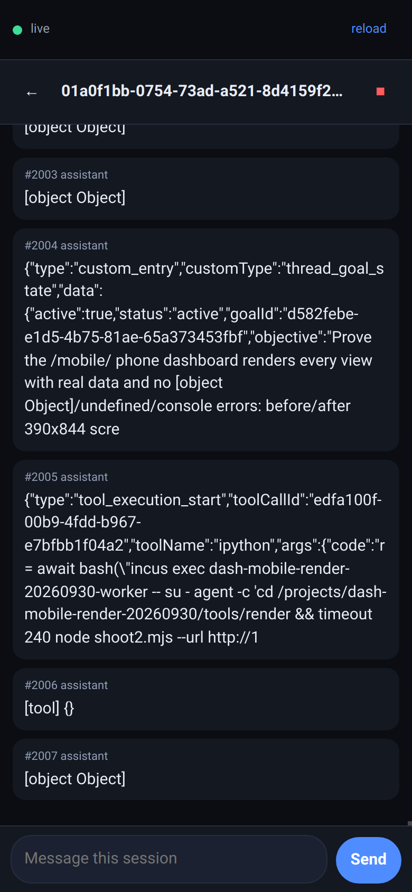
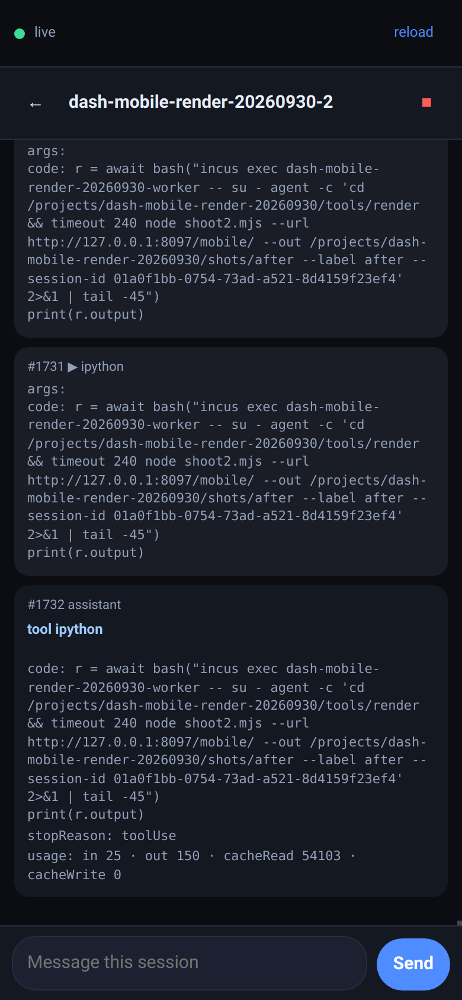

# The phone client (`/mobile/`) and how it renders

`/mobile/` is a thin, same-origin phone client for this dashboard. It is static
files under `public/mobile/`, served by `routes/static-subapp-route.ts`, and it
uses only the existing public surface:

- `GET /api/sessions` — the list
- `POST /api/ws-ticket` — a single-use ticket (this is the network-guarded call)
- `WS /ws?ticket=…` — the live stream, per `packages/shared/src/browser-protocol.ts`

It changes no server behaviour. Anything it needs, the desktop client already
asks for.

## Why this document exists

The client shipped without anyone ever rendering it against a real session. The
`dash-guard` review measured `/mobile/` as `200 1649 B <title>pi mobile</title>`
— a correct HTTP response describing a page nobody had looked at. When it was
finally rendered on a phone-sized viewport with a live session behind it, the
session view was a wall of `[object Object]`.

Three separate payload-shape faults were behind it, and none of them is visible
without real data on the screen:

1. **`data.message` is not a string.** It is the pi message *object*, whose
   content is an array of blocks. `String()` on it yields `[object Object]`. The
   old `textOf()` reached for `usage`, `turnUsage`, `contextUsage`, `model`,
   `args`, `details` and `content` the same way, and `tool_result` read
   `d.output`/`d.text`, which no wire field matches.
2. **`'title'` is not a `DashboardSession` field.** The detail header therefore
   drew a raw 36-character UUID. Precedence now matches
   `getSessionDisplayName`.
3. **`sessions_list` is not a session list.** It is `PiSessionInfo[]` for a
   *single cwd*. The PoC replaced the whole list with it, so one folder's worth
   of files wiped every other session off the phone. The desktop client ignores
   the message outright (`useMessageHandler.ts`); so does this one.

## The rule the formatter follows

`public/mobile/src/format.js` is the single place a payload becomes text.

**No code path can emit `[object …]`, `undefined` or `NaN`.** An unrecognised
shape is printed in full, with its keys — unknown data is made readable, never
silently dropped.

Two more behaviours worth knowing:

- dispatch is on `event.eventType`, not `data.type` (36 of 2076 recorded events
  carry no `data.type` at all, and every one of them is a `stats_update`);
- `message_update` is a **cumulative snapshot** of the assistant message, not a
  delta. 1635 of 2076 recorded events were them, and appending each one drew the
  same sentence as dozens of stacked near-identical rows. The newest snapshot
  per turn wins, which is the same rule as the reference reducer's
  `streamingTextFlushed`.

## Reading the screenshots

Both are 390x844, the same session, minutes apart, real data from a live
dashboard.

<table>
<tr>
<td width="50%" align="center"><br/><sub><b>Before</b> — raw UUID header, <code>[object Object]</code>, raw JSON dumps</sub></td>
<td width="50%" align="center"><br/><sub><b>After</b> — session name, labelled tool calls, real usage line</sub></td>
</tr>
</table>

| | Before | After |
|---|---|---|
| Detail header | `01a0f1bb-0754-73ad-a521-8d4159f2…` | `dash-mobile-render-20260930-2` |
| A tool call | `[tool] {}` | `#1731 ipython` + its `args` as text |
| An assistant turn | `[object Object]` | the text, plus `usage: in 25 · out 150 · cacheRead 54103 · cacheWrite 0` |

The list view was readable in both, which is exactly why the defect survived —
the list looks fine right up until you open a session.

## The test that keeps this true

```bash
pnpm test:mobile-render
```

`tests/mobile-render/` serves this repo's own `public/mobile/` over real HTTP and
WebSocket and replays fixtures **recorded off the live dashboard**. It then
asserts that no value on screen was invented by the renderer, that there are no
console errors, and — the assertion that stops a trivially-passing test — that
recorded strings actually **reach the screen**.

It is provenance-based, not pattern-based, and that distinction matters more
than it sounds. A real agent transcript quotes `[object Object]` whenever anyone
writes about this bug — which this repository's own history now does. A test
that merely greps the rendered text would flag the *data* and pass the defect.
Instead a bad token counts only when it is **not** a substring of a string
inside the event being drawn from: if the source said it, we printed it; if the
source did not, we made it up.

Six tests, no docker harness, about 13 seconds. On the pre-fix commit
(`d49e9954a`) four of the six fail.
